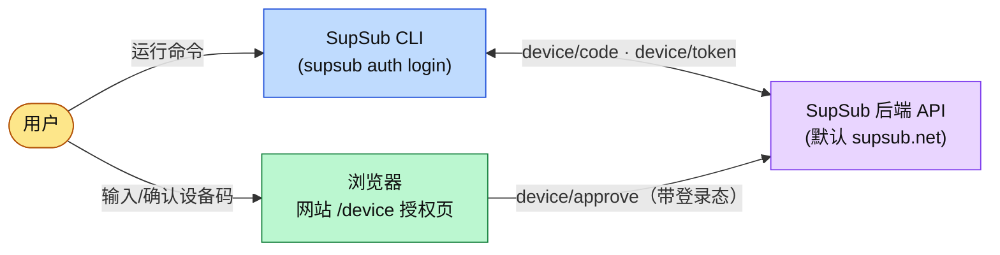
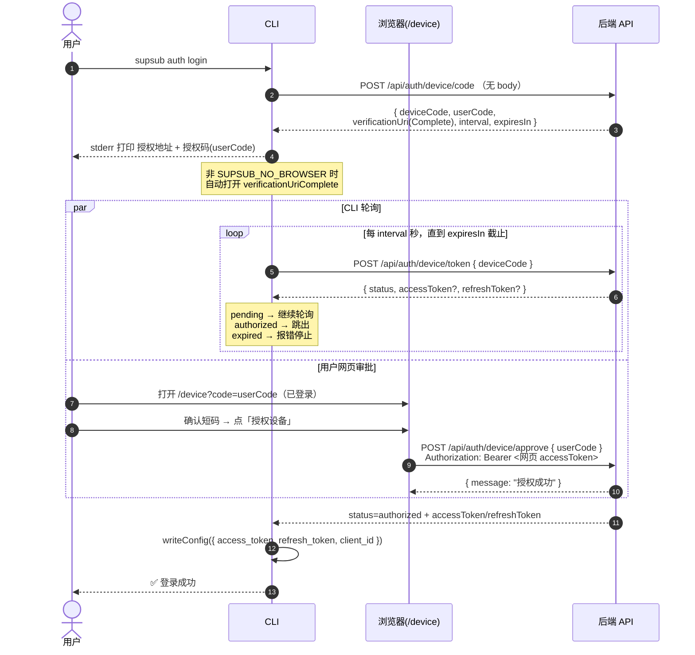
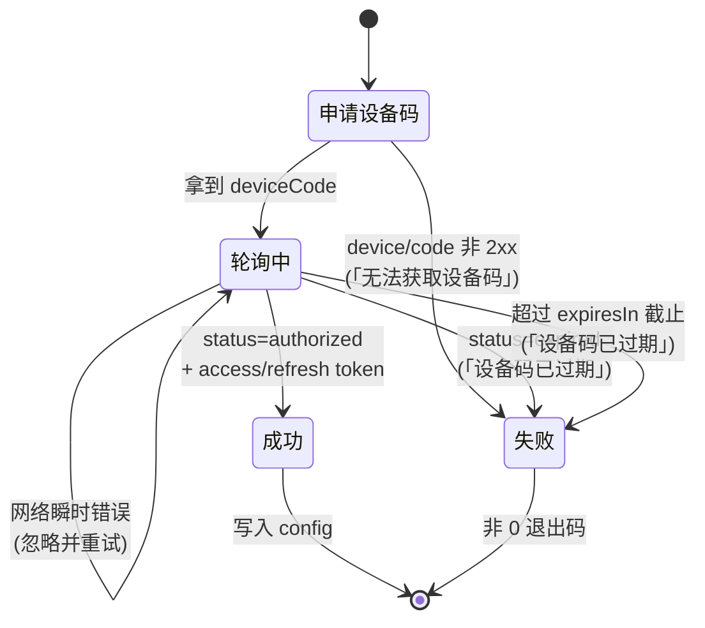
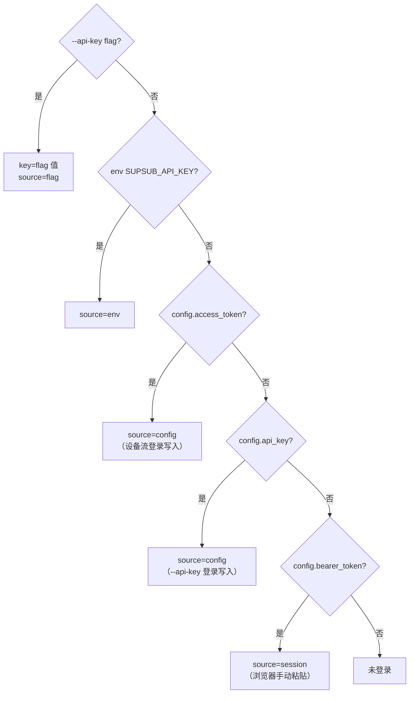
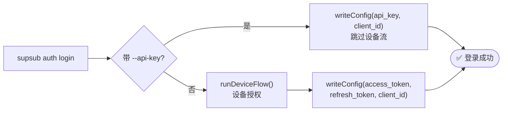

# SupSub CLI 授权流程（OAuth Device Flow）

> 本文以 mermaid 图为主，描述 `supsub auth login` 的设备授权（Device Flow）端到端流程、令牌轮询状态机、凭证解析优先级与相关端点契约。
> 实现位置：`src/api/auth.ts`、`src/commands/auth/device-flow.ts`、`src/commands/auth/login.ts`、`src/http/credentials.ts`、`src/config/store.ts`、`src/http/client.ts`。

---

## 1. 角色与组件

- **CLI** 负责申请设备码、轮询授权状态、落地令牌。
- **浏览器 / 网站 `/device` 页** 负责让**已登录用户**确认短码并审批设备（携带网页登录态调用 `device/approve`）。
- **后端 API** 串联三个端点、签发令牌。CLI 默认基址为 `https://supsub.net`，可用 `--api-url` flag 或 `SUPSUB_API_URL` 环境变量覆盖（flag 优先级更高）。

---

## 2. 设备授权时序（主流程）

要点：
- `device/code`、`device/token` **不需要鉴权**，且**不走统一 `request()`**（避免 401→clearAuth 误触发），在 `src/api/auth.ts` 内用独立 `fetch` 实现。
- 授权地址优先用带码的 `verificationUriComplete`；缺失时回落 `verificationUri?user_code=<userCode>`。
- `device/token` 响应字段对 camelCase（`accessToken`）与 snake_case（`access_token`）均兼容。

---

## 3. 令牌轮询状态机

- `authorized` 但缺令牌 → 视为服务端异常，报「授权成功但未返回令牌」。
- 退出码遵循 `src/lib/exit-code.ts` 语义（`EXPIRED_TOKEN`/`SERVER_ERROR` 等映射为非 0）。

---

## 4. 凭证解析优先级（`resolveApiKey`）

每次请求由 `src/http/client.ts` 调 `resolveApiKey()` 解析出 Bearer 凭证，优先级从高到低：

- 设备流登录把令牌写入 `config.access_token` / `config.refresh_token`（见 `src/config/store.ts` 的 `Config`）。
- `--api-key` 快捷登录跳过设备流，直接写 `config.api_key`。
- 任意请求返回 401 → `client.ts` 调 `clearAuth()` 清除 `api_key`/`access_token`/`refresh_token`/`bearer_token`。

---

## 5. 两条登录路径

登录后 `supsub auth status` → `GET /api/user/info`（携带 Bearer）展示账号信息。

---

## 6. 端点契约（CLI 相关 3 个）

| 端点 | 方法 | 鉴权 | 请求 | 响应 |
|---|---|---|---|---|
| `/api/auth/device/code` | POST | 否 | 无 body | `{ deviceCode, userCode, verificationUri, verificationUriComplete, interval, expiresIn }` |
| `/api/auth/device/token` | POST | 否 | `{ deviceCode }` | `{ status: pending\|authorized\|expired, accessToken?, refreshToken? }` |
| `/api/auth/device/approve` | POST | 是（网页登录态） | `{ userCode }` | `{ message }` |

> 说明：`device/approve` 由**网站 `/device` 页**调用，CLI 不调用。基址 + path 拼接规则：CLI 请求 = `${SUPSUB_API_URL}` + 上述含 `/api` 前缀的 path。

---

## 7. 环境变量

| 变量 | 作用 | 默认 |
|---|---|---|
| `SUPSUB_API_URL` | 覆盖 API 基址（等价于 `--api-url` flag，但 flag 优先级更高） | `https://supsub.net` |
| `SUPSUB_API_KEY` | 注入 Bearer（source=env） | 无 |
| `SUPSUB_NO_BROWSER` | 真值时 `auth login` 不自动打开浏览器（e2e / 无头环境） | 未设 |
| `SUPSUB_CONFIG_DIR` | 覆盖配置目录（测试隔离用） | `~/.supsub` |
